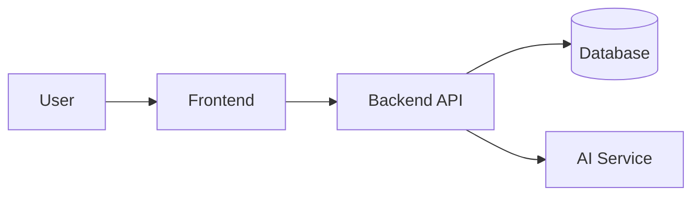

# Architecture

> Carry this forward from your Lab 5 design. Keep it a living document: when the
> real code drifts from this, update this file (or the code).

## 1. Overview

_One paragraph: the big picture. What are the main parts and how do they talk?_

## 2. Component diagram

Paste or embed your diagram from Lab 5. You can keep it as an image, or draw it
in text with [Mermaid](https://mermaid.js.org) (GitHub renders it automatically):

_Replace the example above with your real components._

## 3. Key modules

| Module | Responsibility | Lives in |
|--------|----------------|----------|
| _TODO_ | _TODO_ | `src/...` |

## 4. Data model

_Main entities and their relationships (from your Lab 5 class design)._

## 5. Key flows

_For 1–2 important use cases, describe the sequence (link your Lab 5 sequence diagrams)._

## 6. The AI-assisted component

_How does AI fit into the running system (not the dev tools)? Which model/API,
what data goes in, what comes out, and what happens if it fails or is unavailable?_

## 7. Known trade-offs / open questions

_Things you decided to defer or are unsure about. Honesty here is graded well._
